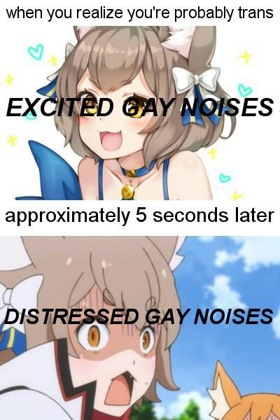

Sometimes it's a little odd to hear these things from other people so I thought I'd leave a nice open letter to whom it may concern. No wait, this isn't a generic letter to just anyone. This is a letter I am writing specifically for _you_. That's right, directly from me to you; Just you. You probably heard some confusing things, or caught wind of some stuff you don't understand. I am here to make some clarifications, set the record straight, just in case you missed the news.

Since this is just a personal letter between me and you I'm going to add an appropriate meme. You know me and memes; I can't live without them.

For about 36 years of my life I went by a lot of different names from Xanaphia, Jonny, David, tBunnyMan, DJ Epic MegafaiL, and even BitM… Things have changed.

Now I'm going by Amy.

If you prefer; bunny, squirrel, she, her, they, D.O.S., or even OnlyHaveCans are all perfectly acceptable things to call me, so you have lots of choices.

I'm super happy living as a woman. My family and friends have been super supportive and I even have an amazing therapist. All in all I'm happier than I have ever been. Transitioning is not something you experiance without stressors jumping in but that is what the support of friends are for.

You may have questions, that's great. I'd excited to spend some time explaining anything you want to know about. Just drop me a message. I'm still a fan of email if you don't know a better way to contact me. Just send me an email to Squirrel at Wearing dot Black. Oh yea. That's a `wearing.black` domain. Working in domains has taught me about all the coolest gTLDs.

Sorry that I told you though this letter, which I ended up posting to my blog publicly as well. It's hard to tell everyone in person. It was super awesome talking to you again though! It's been way way way too long so write me back! I know I suck at reaching out sometimes but I can always find time to reply to a letter.

Best Wishes,
Amy A.

P.S. I won't be answering questions in the comments.
